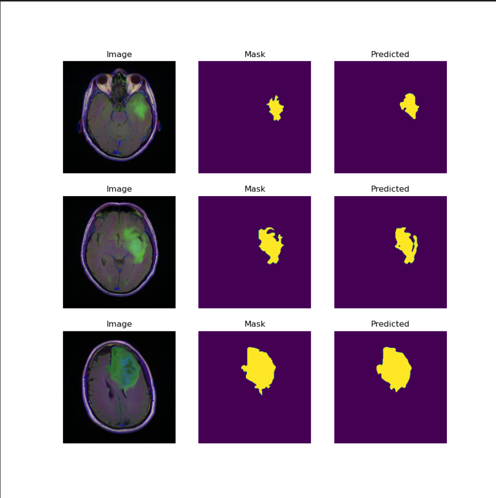

# TCGA Brain Tumor Segmentation

## 📌 项目简介
这是一个基于 MRI 图像的颅脑肿瘤自动分割项目，使用 UNet 模型进行训练和推理。

主要功能：
- 自动分割脑部肿瘤区域
- 支持训练新模型
- 可视化预测结果

## 📌 项目说明
这是我的新手练习项目，主要目的是熟悉医学图像分割的流程并提高动手能力、加深对知识的理解。  

在 TCGA 颅脑肿瘤 MRI 数据上的实验结果：  

- **DICE 系数**: `0.8127`  

该结果并不算高，仅供学习和参考。


## 📌 项目结构
```
TCGA-BrainTumorSegmentation/
├─ main.py            # 训练与推理主程序
├─ Unet.py            # UNet 网络结构定义
├─ view.py            # 可视化工具
├─ images/            # segmentation result
├─ Data/              # MRI 数据集（自行下载）
├─ model/             # 训练模型（下载链接见下方）
├─ MRI/               # 训练可视化图（可选）
├─ __pycache__/       # Python 缓存（已忽略）
├─ .idea/             # IDE 配置（已忽略）
├─ .gitignore         # 忽略文件配置
├─ README.md          # 项目说明
```

## 📌 安装依赖
建议使用虚拟环境安装依赖：
```bash
python -m venv venv
# Linux / macOS
source venv/bin/activate
# Windows
venv\Scripts\activate

pip install -r requirements.txt
```

## 📌 数据集下载
请前往 TCGA 官方网站下载脑部 MRI 数据集，并放置在 `Data/` 文件夹下：
- [TCGA 数据集下载链接](https://www.kaggle.com/datasets/mateuszbuda/lgg-mri-segmentation)

## 📌 模型下载
训练好的 UNet 模型文件可从以下地址下载，并放入 `model/` 文件夹：
- [示例模型下载链接](https://github.com/shimmer-Li/TCGA-BrainTumorSegmentation/releases/download/v1.0/best_model.pth)


## 📌 使用方法
1. 准备数据到 `Data/`
2. 训练模型：
```bash
python main.py
```
3. 查看可视化预测结果：
```bash
python view.py
```

## 📌 分割结果示意图

下面展示了该模型在 TCGA 脑 MRI 数据集上的分割效果：



图中：
- 左边为原始 MRI 图像
- 中间为真实标注（Ground Truth）
- 右边为模型分割结果


